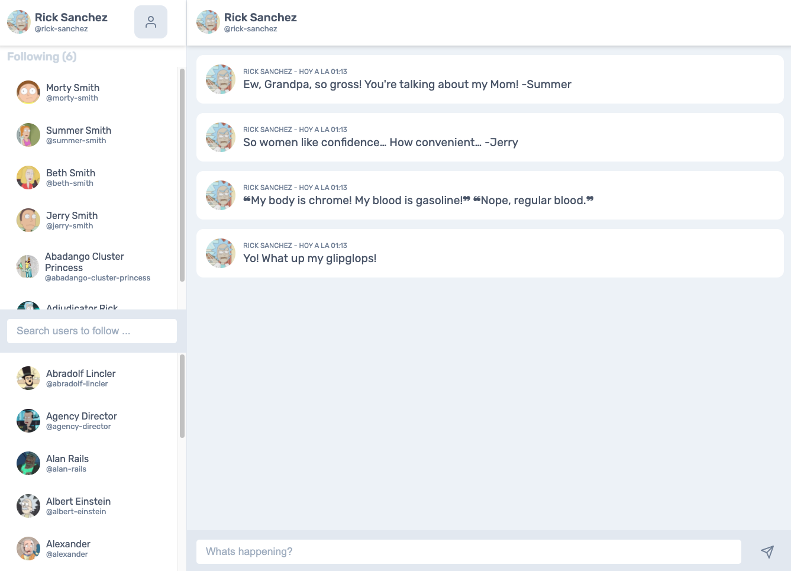

# Twitter sample app



## Live site demo

[https://twitter-sample-app.netlify.app/](https://twitter-sample-app.netlify.app/)

## Instructions

### Download repository

```bash
git clone https://github.com/webbegg/twitter-sample-app
```

### Install dependencies

```bash
cd twitter-sample-app
yarn # or npm install
```

### Run in dev mode

```bash
yarn start # or npm start
```

## Run e2e tests

```bash
yarn cypress:open # or npm run cypress:open
```

## License

MIT © [webbegg](https://github.com/webbegg)
